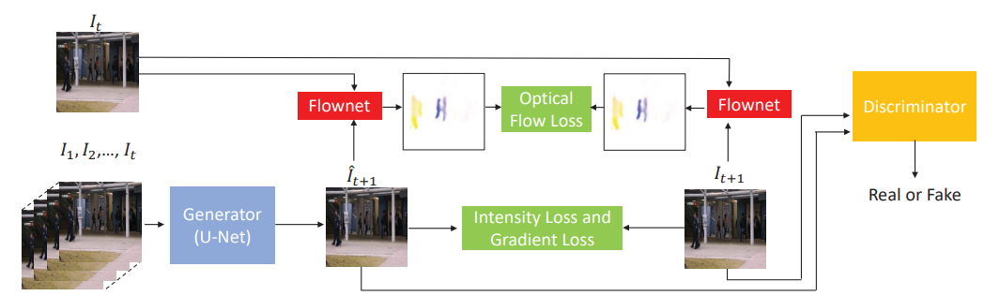

# FutureFramePrediction.pytorch

## Introduction

This is a PyTorch implementation of [Future Frame Prediction for Anomaly Detection – A New Baseline](https://openaccess.thecvf.com/content_cvpr_2018/papers/Liu_Future_Frame_Prediction_CVPR_2018_paper.pdf).

<p align="center"></p>

|  |  |
|---|---|
| Input image | result |

## Preresquisties
* PyTorch
* tqdm
* Albumentations
* NumPy
* imageio

## How to train

* For training, you should get a sequence of video frames which contains 'normal' situations.
* It is a good way to see [UCSD Anomaly Detection Dataset](http://www.svcl.ucsd.edu/projects/anomaly/dataset.html) to get more details.
* Put a sequence and set your training phase at train.py

```
class args():
    # Dataset setting
    channels = 3
    size = 256
    frames_dir = 'datasets/train'
    time_steps = 5
```
where *time_steps* denotes each of size using the sliding window technique.
* Download a pretrained FlowNet model from [Google Drive](https://drive.google.com/file/d/1gwBdKeaJjJomU68x2dNl9Vdy9i9EKiaI/view) and write its location as follows
```
class args():
    # optical flow setting
    flownet_pretrained = 'pretrained/FlowNet2-SD.pth'
```
* Run the command below
```
python train.py
```

## How to get anomalies
* Just run the command below
```
python demo.py
```
* Then, you can get regularity scores at each frame.

## To-do list
- [ ] Add evaluation codes

## Notes
* For architectures in this repository, I refered to great works such
[FlowNet](https://github.com/NVIDIA/flownet2-pytorch), [UNet](https://github.com/milesial/Pytorch-UNet/tree/master/unet) and [PatchDiscriminator](https://github.com/junyanz/pytorch-CycleGAN-and-pix2pix)
* You can see same results with TensorFlow in [official repository](https://github.com/StevenLiuWen/ano_pred_cvpr2018), and [another PyTorch implementation](https://github.com/feiyuhuahuo/Anomaly_Prediction)
